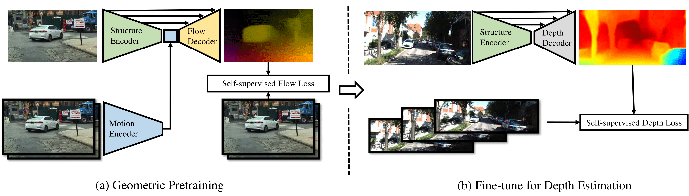
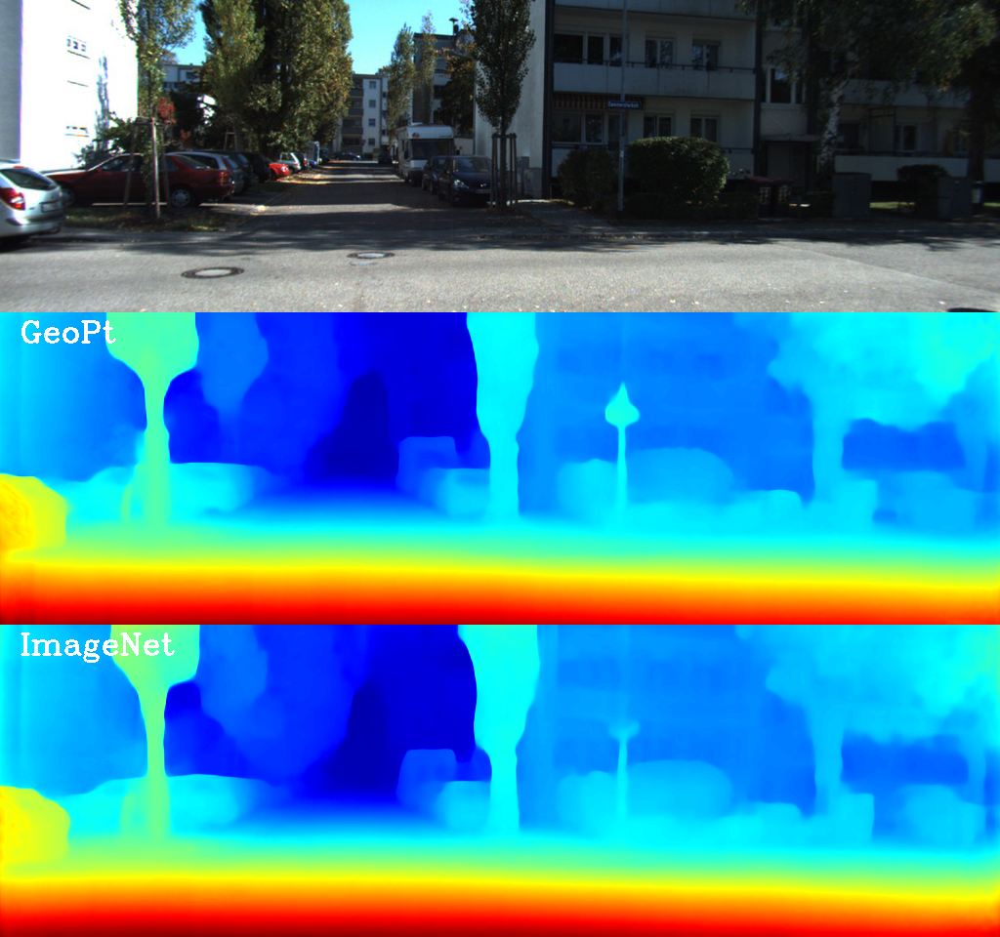
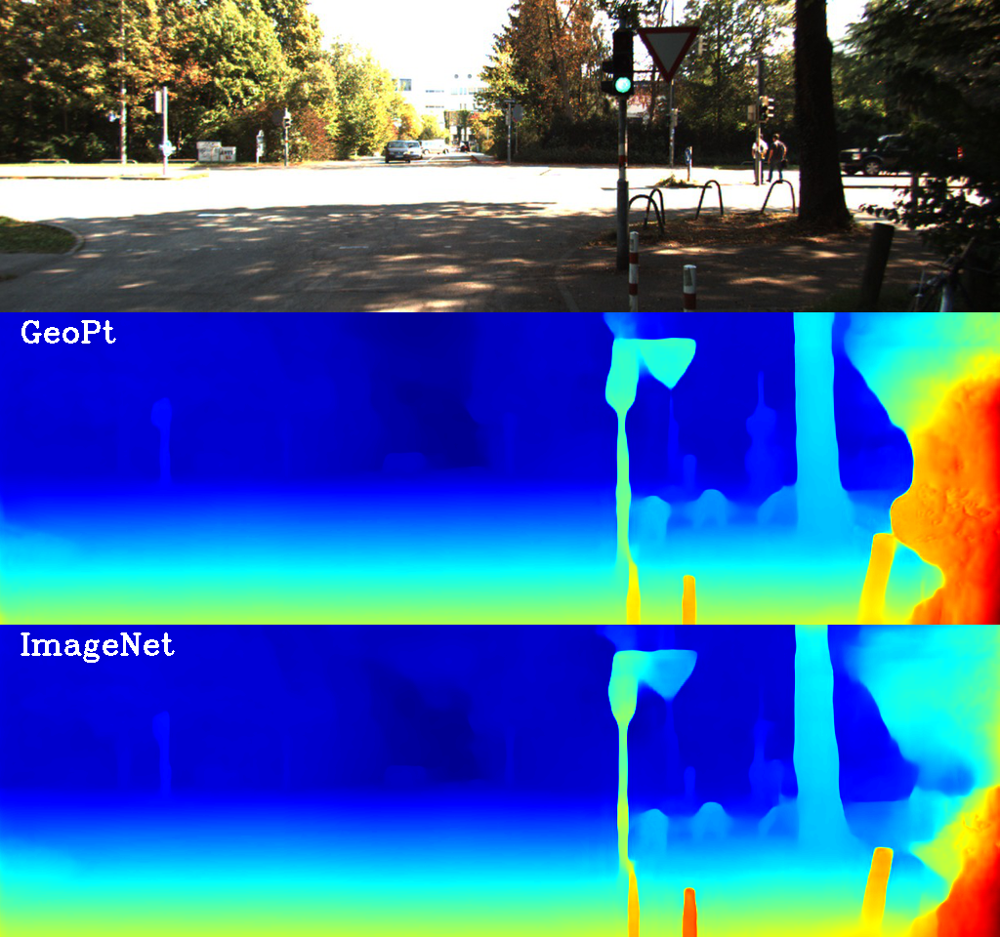
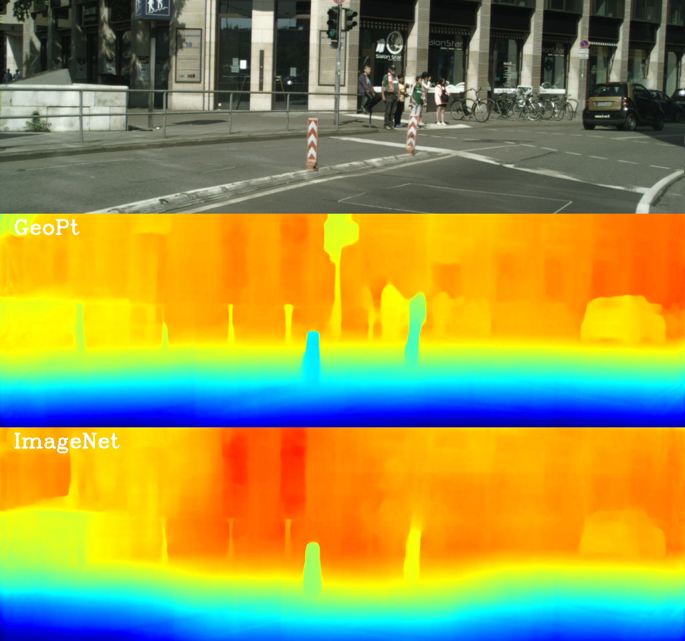
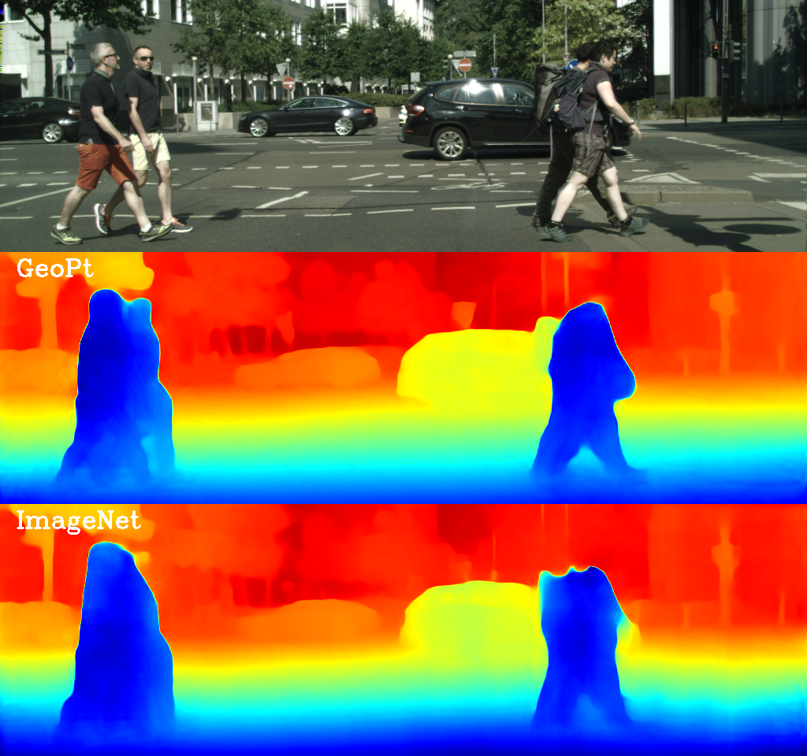
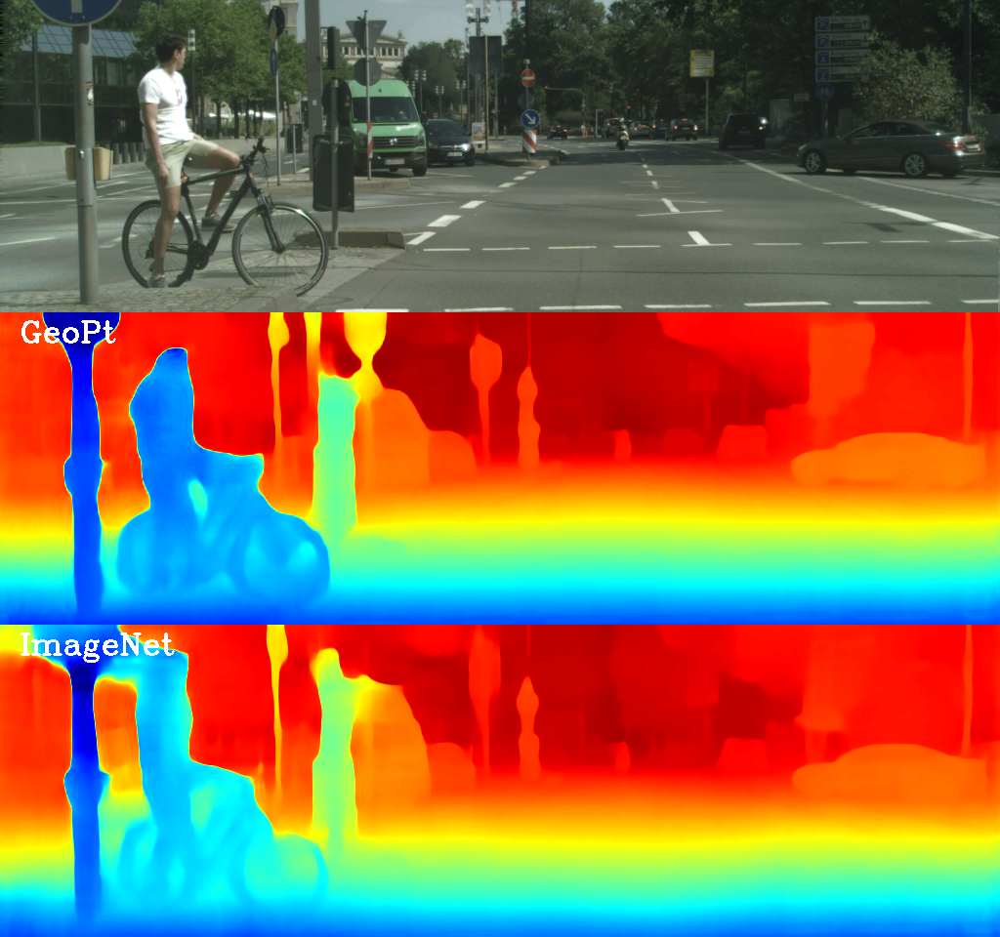
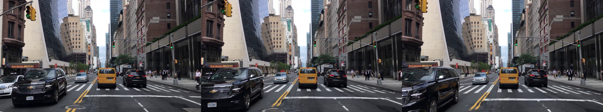

# GeometricPritraining

This is the project page of the paper **"Geometric Pretraining for Monocular Depth Estimation''**.

GeometricPritraining is a pretrain task designed specifically for depth estimation. The pretrain task requires only **uncalibrated** images from existing datasets or the internet. After the pretraining stage, the backbone network can be transferred to depth estimation tasks. Using unlimited images from the internet, we demonstrate that the geometric-pretrained networks perform better than ImageNet-pretrained networks by a large margin. **At the time of the submission, the proposed geometric pretrained networks achieve the new state-of-the-art performance using only existing training methods.**

This project page contains:

* the implementation of the pretrain task,

* the scripts to extract training images from internet videos.

* the geometric pretrained networks and the corresponding transferred depth estimation networks.

All components will be open source once the paper is accepted.

## News
2020-06-22: The open-source procedure is delayed by the unexpected COV-19 situation. We will gradually release models in the following week.

2019-11-02: We pretrained encoder networks using the new dataset and achieves new state-of-the-art results. These pretrained methods will be released shortly.

2019-11-02: We built a new dataset using methods described in the paper that contains only Youtube wild frames. The dataset contrains 151k image pairs for training and 16k images for testing. We are willing to release the extracted frames as a open-source dataset for the community. However, due to the Youtube license, we are afride that the dataset cannot be released without the creators' approvement. We are now contacting the creators.

## The proposed method

The proposed method uses a conditional encoder-decoder network to reconstruct the optical flow between two images. With a narrow bottleneck, the encoder network is forced to learn motion-invariant structure information. After the pretraining, the encoder can be transferred to depth estimation using existing methods (e.g. [Monodepth2](https://github.com/nianticlabs/monodepth2)). The system is illustrated in the following figure.

After the pretrain, the transferred network show better accuracy, generalization ability, and few-shot learning.

* The KITTI-trained network tested on KITTI dataset:

GeoPt is geometric pretrained backbone. Click each photo for full resolution.

<table align='center'>
<tr>
<td></td>
<td></td>
<td></td>
</tr>
</table>

* The KITTI-trained network tested on CityScapes:

<table align='center'>
<tr>
<td></td>
<td></td>
<td></td>
</tr>
</table>

* The KITTI-trained network tested on YouTube videos:

## The proposed dataset DrivingVideos

There are countless of images on the internet. In this project, we build the pretrain dataset, DrivingVideos, using videos from the internet. Due to the current size of the pretrain dataset, we mixed the pretraining dataset using KITTI, CityScapes, and DrivingVideos. We are still enlarging the dataset. In the future, we will use only DrivingVideos for the pretraining as experiments show that this leads to the best transferred performance. For more details please check the paper.

A tipical sample from DrivingVideos is a 3-frame sequential image with no calibration informatiom:

## The pretrained networks and transferred depth networks

Here, we provide the pretrained networks and transferred depth networks ([Monodepth2](https://github.com/nianticlabs/monodepth2) is used for the transferring). For details, please check the paper.

Backbone Networks:

| Model | Layer Num. | Resolution | KITTI | CityScapes | DrivingVideos_small | DrivingVideos_big | Youtube New | Link |
| ----- | ---------- | ---------- | ----- | ---------- | ------------------- | ----------------- | ----------- | ---- |
| kcd   | 18         | 640x192    | Yes   | Yes        | Yes                 | No                | No          | ---- |
| kc    | 18         | 640x192    | Yes   | Yes        | No                  | No                | No          | ---- |
| d     | 18         | 640x192    | No    | No         | No                  | Yes               | No          | ---- |
| kcd_hd| 50         | 1024x320   | Yes   | Yes        | Yes                 | No                | No          | ---- |
| youtube18 | 18         | 640x192    | No    | No         | No                  | No                | Yes         | ---- |
| youtube50 | 50         | 1024x320   | No    | No         | No                  | No                | Yes         | ---- |

Transferred Networks (evaluation using the code from Monodepth2):

| Backbone| Training Mode | Abs Rel | Sq Rel | RMSE | RMSE log | delta < 1.25 | Link |
| ------- | ------------- | ------- | ------ | ---- | -------- | ------------ | ---- |
| kcd_hd  | MS (1024x320) | 0.093   | 0.704  | 4.367| 0.183    | 0.896        | ---- |
| kcd_hd  | MS (640x192)  | 0.099   | 0.757  | 4.547| 0.187    | 0.888        | ---- |
| kcd     | MS (640x192)  | 0.105   | 0.804  | 4.693| 0.193    | 0.874        | ---- |
|   d     | M  (640x192)  | 0.112   | 0.820  | 4.707| 0.189    | 0.879        | ---- |
|   d     | S  (640x192)  | 0.105   | 0.816  | 4.820| 0.204    | 0.869        | ---- |
|youtube18| S  (640x192)  | 0.105   | 0.840  | 4.785| 0.202    | 0.873        | ---- |
|youtube18| MS (640x192)  | 0.103   | 0.819  | 4.668| 0.190    | 0.881        | ---- |
|youtube18| M  (640x192)  | 0.111   | 0.879  | 4.735| 0.188    | 0.883        | ---- |
|youtube50| S  (1024x320) | 0.097   | 0.735  | 4.548| 0.194    | 0.886        | ---- |
|youtube50| MS (1024x320) | 0.094   | 0.707  | 4.335| 0.182    | 0.897        | ---- |
